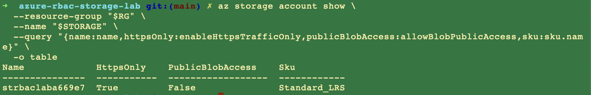
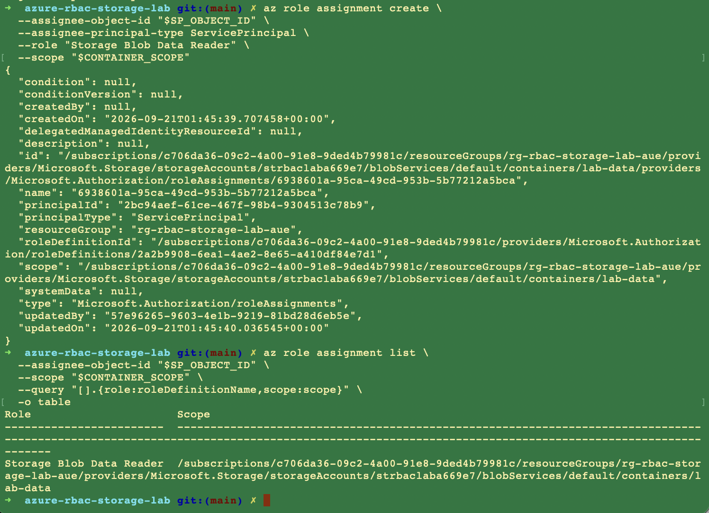
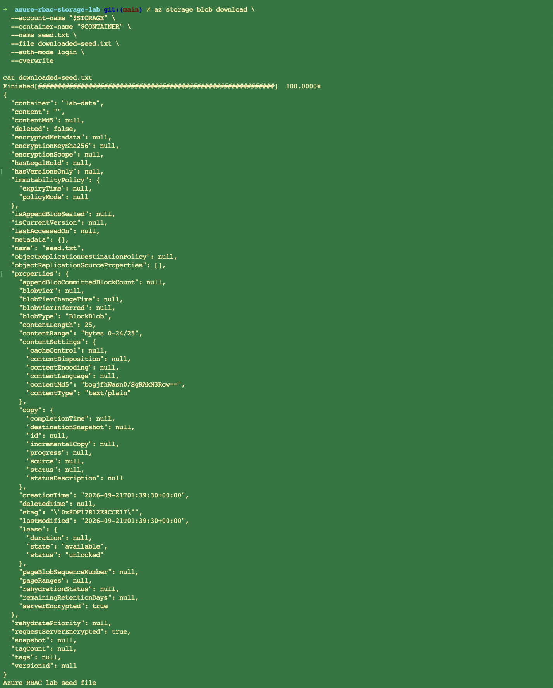
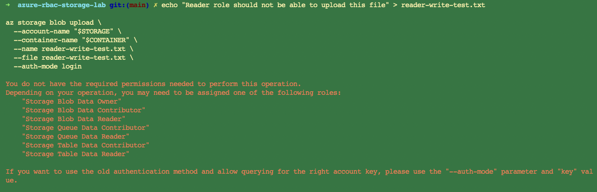
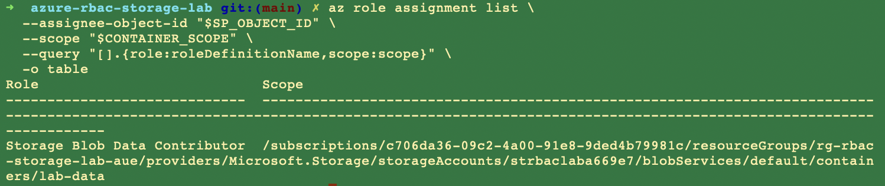
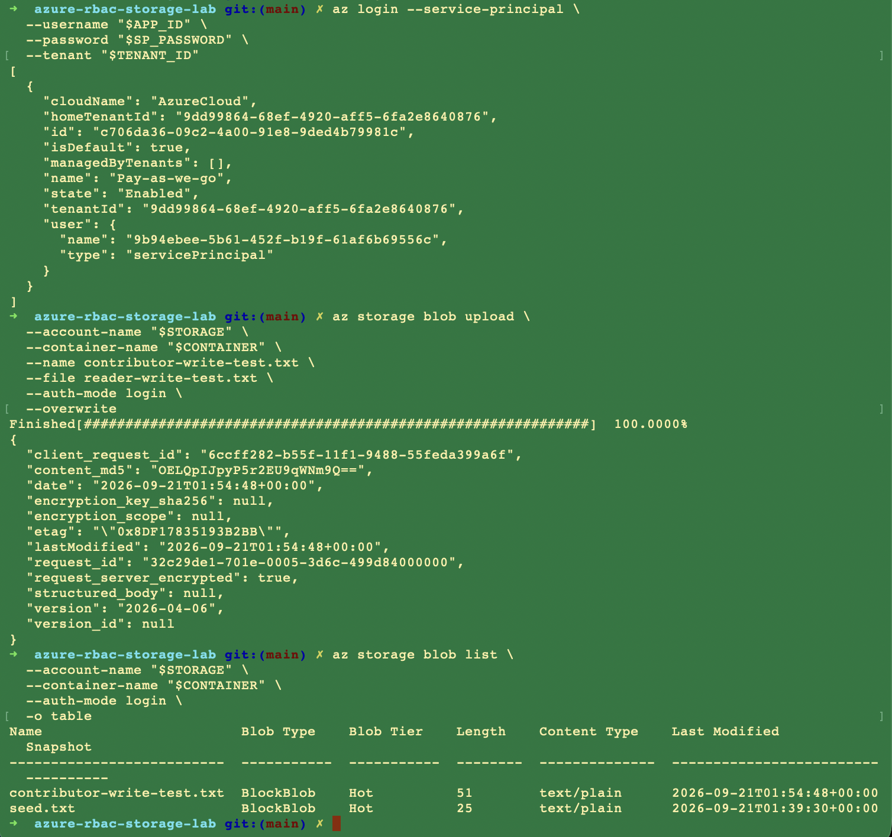
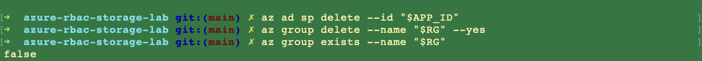

# Azure RBAC & Storage Access Lab

A disposable Azure lab that proves **least-privilege Blob Storage access** with a separate identity — not just that a storage account can be created.

## Recruiter 60-second view

| Check | Result |
|---|---|
| Storage configured privately | HTTPS-only, public blob access **disabled**, private container |
| Separate identity used for testing | Temporary service principal `sp-rbac-storage-lab-a669e7` |
| Reader access scoped narrowly | `Storage Blob Data Reader` at **container** scope (`lab-data`) |
| Read positively tested | Same identity listed and downloaded `seed.txt` |
| Write negatively tested | Upload denied as Reader |
| Role change verified | Same identity uploaded after `Storage Blob Data Contributor` |
| Cleanup completed | Service principal and resource group deleted |

This repo is evidence of **RBAC reasoning and verification**. Resource creation was only the setup.

## Scenario

A workload needs to read files from one blob container and must not be able to change them.

I assigned the test service principal `Storage Blob Data Reader` at container scope, authenticated as that identity, and verified that read/list succeeded while upload was denied. I then changed one variable — the role — to `Storage Blob Data Contributor` and repeated the same upload. It succeeded.

That comparison is the project.

```text
Admin identity
      |
      v
Private Storage Account  -->  container: lab-data  -->  seed.txt
      ^
      |
Test service principal
      |
      +-- Stage 1: Storage Blob Data Reader      -->  read yes / write no
      |
      +-- Stage 2: Storage Blob Data Contributor -->  read yes / write yes
```

Tests used Azure CLI with `--auth-mode login` so authorization went through Microsoft Entra ID and Azure RBAC, not a storage account key.

## Lab facts

| Item | Value |
|---|---|
| Region | Australia East |
| Resource group | `rg-rbac-storage-lab-aue` |
| Storage account | `strbaclab669e7` (`StorageV2`, `Standard_LRS`) |
| Container | `lab-data` (private) |
| Test identity | `sp-rbac-storage-lab-a669e7` |
| Data-plane auth | `--auth-mode login` |

## Evidence

### 1. Storage was private

Public blob access is off. HTTPS-only is on. The container was seeded as the administrator, not as the test identity.




### 2. A separate identity was used

The test principal was created with no role assignment. Presence of IDs is confirmed; the secret is not printed.


Using the admin identity for the access test would have been useless. An admin can already write.

### 3. Reader was scoped to one container

`Storage Blob Data Reader` on `lab-data` only — not the subscription, not the resource group, not the whole storage account.



### 4. Read succeeded

Authenticated as the service principal, `seed.txt` downloaded and the contents matched.



### 5. Write was denied

Same identity, same container, same `--auth-mode login`. Upload failed with a permissions error. Azure suggested Contributor / Owner — which is the point.



A role assignment is not proven until the **forbidden** operation fails.

### 6. Contributor changed the observed behavior

Reader was removed. `Storage Blob Data Contributor` was assigned at the same container scope.



The same principal then uploaded `contributor-write-test.txt`. Both blobs are listed.



```text
Reader      ->  read yes / write no
Contributor ->  read yes / write yes
```

One variable changed. The result changed with it.

### 7. Identity and resources were removed

```text
az ad sp delete --id "$APP_ID"
az group delete --name "$RG" --yes
az group exists --name "$RG"    # false
```



## What this proves

- **Management plane ≠ data plane.** Creating a storage account is not the same permission set as reading or writing blobs.
- **Scope matters as much as the role name.** Reader on one container is a different grant than Reader on the account or subscription.
- **Negative tests are the least-privilege evidence.** Allowed reads alone do not prove a read-only role.
- **RBAC is eventually consistent.** If both read and write fail immediately after assignment, wait and retry before assuming the role is wrong.
- **Cleanup is part of the lab.** Disposable identities and resource groups limit cost and leftover privilege.

## Security decisions

| Lab control | Why |
|---|---|
| Public blob access disabled | The test is about RBAC, not anonymous URLs |
| Separate service principal | Admin rights would contaminate the result |
| Container-scoped data role | Least privilege, not subscription-wide access |
| `--auth-mode login` | Forces Entra/RBAC; avoids proving access with an account key |
| No secrets in screenshots or git | Password never printed, never committed |
| SP + resource group deleted the same day | No leftover identity or billable storage |

A production workload would usually prefer a **managed identity** or **workload identity** over a client secret. It would also need access reviews, logging, and an approval path for role changes. This lab does not claim that.

## Docs

- [Lab walkthrough](docs/walkthrough.md) — setup, tests, and commands
- [Security and production notes](docs/security.md) — lab controls vs a real tenant

## Tools

Azure CLI · Microsoft Entra ID · Azure Blob Storage · Azure RBAC
