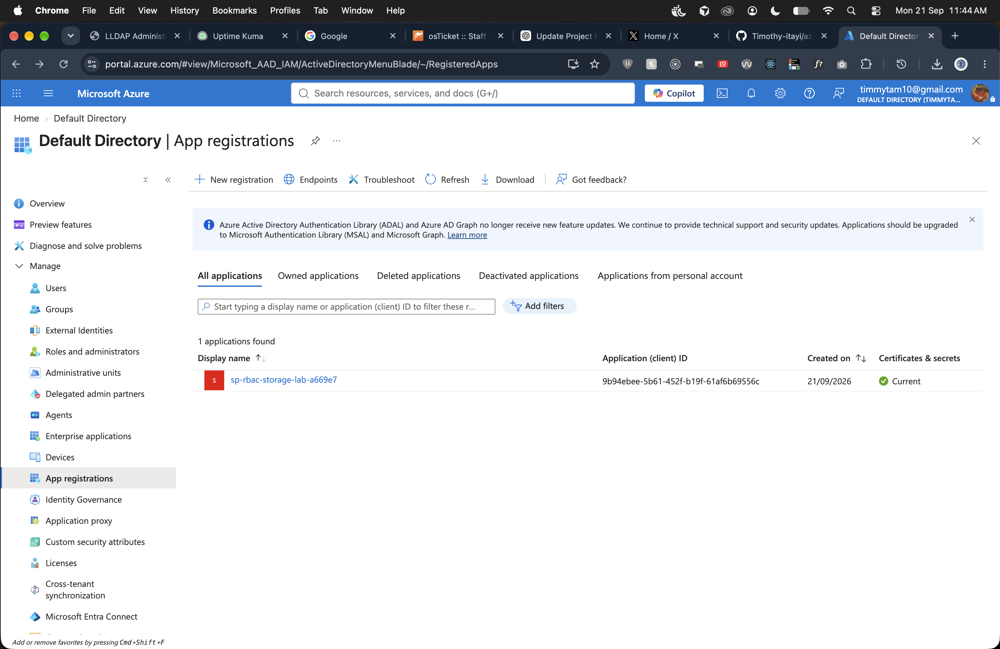

# Azure RBAC & Storage Access Lab

A disposable Azure lab that proves **least-privilege Blob Storage access** for a separate identity. Storage was created only so the access test had something to fail against.

A workload needed to read one private container and not write to it. I assigned `Storage Blob Data Reader` at container scope, authenticated as a temporary service principal, and verified read succeeded while upload was denied. Changing that one role to `Storage Blob Data Contributor` made the same write succeed. Identity and resources were deleted afterwards.

```text
Admin identity -> private Storage Account -> container lab-data
                         ^
                         |
              test service principal
                 Reader  ->  Contributor
              read yes      write yes
              write no
```

## Azure Portal

Temporary app registration used for the test. No client secret is shown.



## Documentation

| Page | What it covers |
|---|---|
| [Lab walkthrough](docs/walkthrough.md) | Setup, tests, and commands |
| [CLI evidence](docs/evidence.md) | Read allowed, write denied, role change, cleanup |
| [Security notes](docs/security.md) | Lab controls vs a real tenant |
