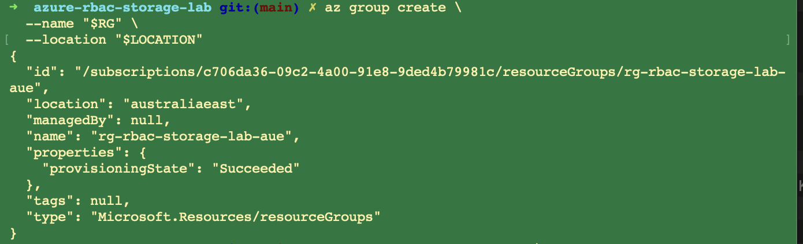
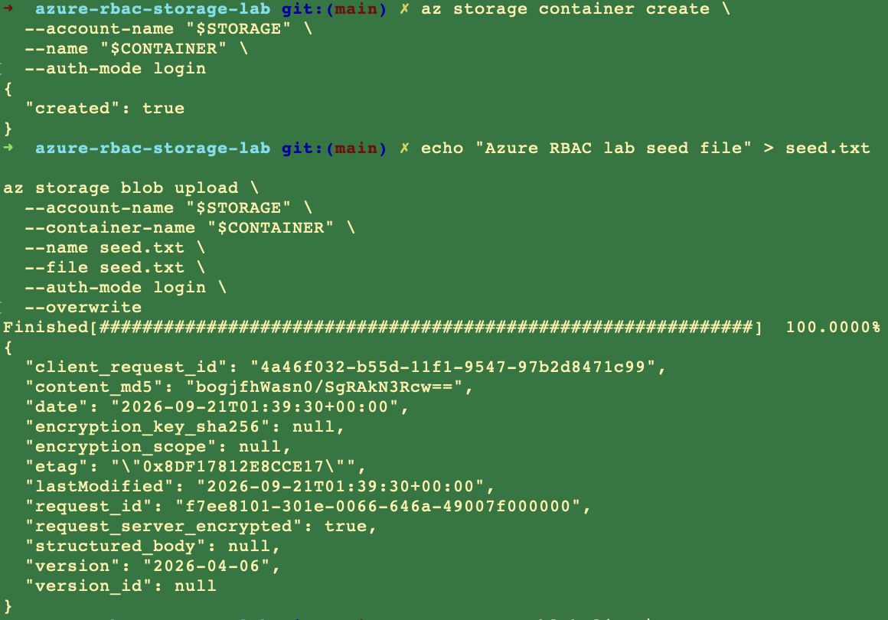
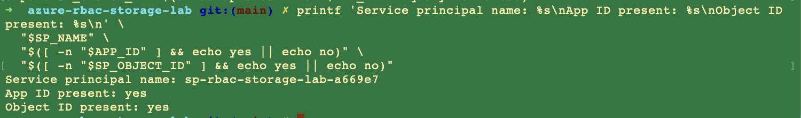

# Lab walkthrough

This is the command-level record. The [README](../README.md) is the brief. Screenshot proofs live in [CLI evidence](evidence.md).

All tests used environment variables. Secrets were never echoed, committed, or captured in screenshots.

## What was built

```text
Mac Terminal
    |
    | Azure CLI
    v
Azure subscription
    |
    +-- rg-rbac-storage-lab-aue          (Australia East)
         |
         +-- strbaclab669e7              StorageV2 / Standard_LRS
              |
              +-- lab-data               private container
                   |
                   +-- seed.txt          admin-seeded
                   +-- contributor-write-test.txt   after role change

Microsoft Entra ID
    |
    +-- sp-rbac-storage-lab-a669e7
          |
          +-- Stage 1: Storage Blob Data Reader      (container scope)
          |
          +-- Stage 2: Storage Blob Data Contributor (container scope)
```

## 1. Foundation

Resource group, then a private-by-default storage account:

```bash
az group create --name "$RG" --location "$LOCATION"

az storage account create \
  --name "$STORAGE" \
  --resource-group "$RG" \
  --location "$LOCATION" \
  --sku Standard_LRS \
  --kind StorageV2 \
  --https-only true \
  --min-tls-version TLS1_2 \
  --allow-blob-public-access false
```

Verified:

```text
Name            HttpsOnly    PublicBlobAccess    Sku
strbaclab669e7  True         False               Standard_LRS
```



The administrator then created the private container and uploaded `seed.txt`. The test identity was not used for this step.



## 2. Temporary test identity

Created with `--skip-assignment` so it had **no** data role until one was granted on purpose.

```bash
az ad sp create-for-rbac --name "$SP_NAME" --skip-assignment -o json
```

The password was kept in a shell variable. Verification only printed whether IDs existed:

```text
Service principal name: sp-rbac-storage-lab-a669e7
App ID present: yes
Object ID present: yes
```



## 3. Reader assignment and tests

Assigned at **container** scope, then listed to confirm:

```bash
az role assignment create \
  --assignee-object-id "$SP_OBJECT_ID" \
  --assignee-principal-type ServicePrincipal \
  --role "Storage Blob Data Reader" \
  --scope "$CONTAINER_SCOPE"
```

Logged out of the admin session and signed in as the service principal. Blob commands used `--auth-mode login`.

| Test | Expected | Observed |
|---|---|---|
| `az storage blob download` `seed.txt` | succeed | downloaded; contents matched |
| `az storage blob upload` `reader-write-test.txt` | deny | `You do not have the required permissions` |

Azure suggested `Storage Blob Data Contributor` or `Owner` for the failed write. That is the expected Reader failure, not a broken lab.

If both read and write fail right after assignment, wait. RBAC is not always immediate.

## 4. Controlled role change

Returned to the admin identity. Removed Reader. Assigned Contributor at the **same** container scope.

Signed back in as the same service principal and retried the upload under a new blob name:

```bash
az storage blob upload \
  --account-name "$STORAGE" \
  --container-name "$CONTAINER" \
  --name contributor-write-test.txt \
  --file reader-write-test.txt \
  --auth-mode login \
  --overwrite
```

`az storage blob list` then showed both `seed.txt` and `contributor-write-test.txt`.

## 5. Teardown

```bash
az logout
az login

az ad sp delete --id "$APP_ID"
az group delete --name "$RG" --yes
az group exists --name "$RG"    # false

unset SP_PASSWORD SP_JSON APP_ID SP_OBJECT_ID TENANT_ID
```

Nothing was left running.

## Evidence index

| File | Proves |
|---|---|
| `00-azure-cli-context.png` | Azure CLI session selected |
| `00-azure-cli-RG.png` | Resource group created |
| `01-storage-account.png` | HTTPS-only, public blob access off |
| `02-private-container-seed.png` | Private container + seed blob |
| `service-principle-AzureCLI.png` | Separate identity, no secret printed |
| `04-reader-role-creation-assignment.png` | Reader at container scope |
| `05-reader-read-success.png` | Read allowed |
| `06-reader-write-denied.png` | Write denied |
| `07-contributer-role-assignment.png` | Contributor at the same scope |
| `08-contributor-write-success.png` | Write allowed after the role change |
| `09-cleanup-complete.png` | Identity and resource group gone |

## Troubleshooting used in this lab

| If this happens | Check this first |
|---|---|
| Read and write both fail after assignment | Wait for RBAC propagation, then retry |
| Write succeeds as "Reader" | Confirm `az account show` is the service principal, not the admin |
| CLI asks for an account key | Add `--auth-mode login` |
| Upload denied as Reader | That is the expected result |

Do not treat a denied Reader write as a configuration error.
